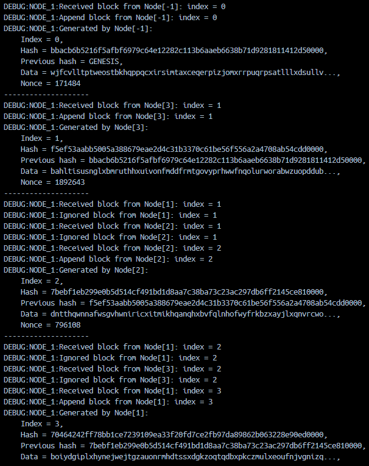
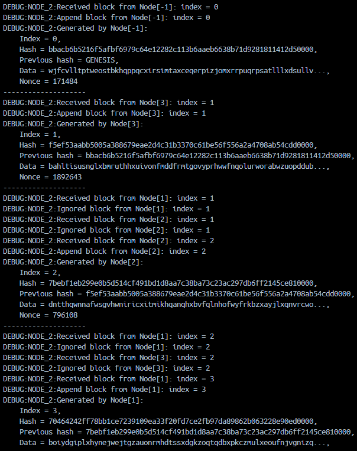

# Python Blockchain
Peter the Great St. Petersburg Polytechnic University: Network Programming task 2023

## Описание
Примитивный Blockchain на Python с использованием веб-серверов на основе Flask. 

- `Block` - класс для генерации блоков цепочки блокчейна, состоящих из следующих полей:
    - `index` - номер блока по возрастанию, начиная с 0 у `GENESIS_BLOCK`
    - `hash` - хеш текущего блока
    - `prev_hash` - хеш предыдущего блока
    - `data` - данные в виде строки из 256 символов
    - `nonce` - дополнение, для удовлетворения условия хэширования
- `Node` - класс узла, который хранит в себе информацию о цепочке блокчейна на данном сервере и содержит функции для обработки нового блока и генерации следующего. 
- `Server` - взаимодействие между веб-серверами путем отправления друг другу новых блоков, сгенерированных относительно своего последнего блока. Генерация происходит бесконечно после получения блока `GENESIS_BLOCK`.

## Тестирование

[](https://github.com/timatifey/python-blockchain/actions/workflows/blockchain.yml)

Написаны unit-тесты.

## Запуск проекта
Для запуска проекта требуется произвести следующие действия:

1) Клонировать проект

`git clone https://github.com/timatifey/python-blockchain.git`

2) Перейти в директорию проекта

```cd python-blockchain```

3) Создать образ 

`docker build -t timatifey/blockchain:latest .`

4) Запустить Docker Compose

`docker-compose up`

## Демонстрация работы

Демонстрация работы проекта с использованием `docker-compose`





Анализируя логи видно, что:
1) Изначально был сгенерирован блок с `prev_hash = GENESIS`, который был разослан всем трем узлам
2) Блок с `index = 1` был сгенерирован на `NODE_3`
3) Блок с `index = 2` был сгенерирован на `NODE_2`
4) Блок с `index = 3` был сгенерирован на `NODE_1`
5) На всех узлах хранятся одинаковые блоки
6) На всех узлах валидная цепочка блоков, так как:
   - `prev_hash` блока совпадает со значением `hash` предыдущего блока (блока с индексом на 1 меньше)
   - `prev_hash` и `hash` заканчиваются на `0000`
